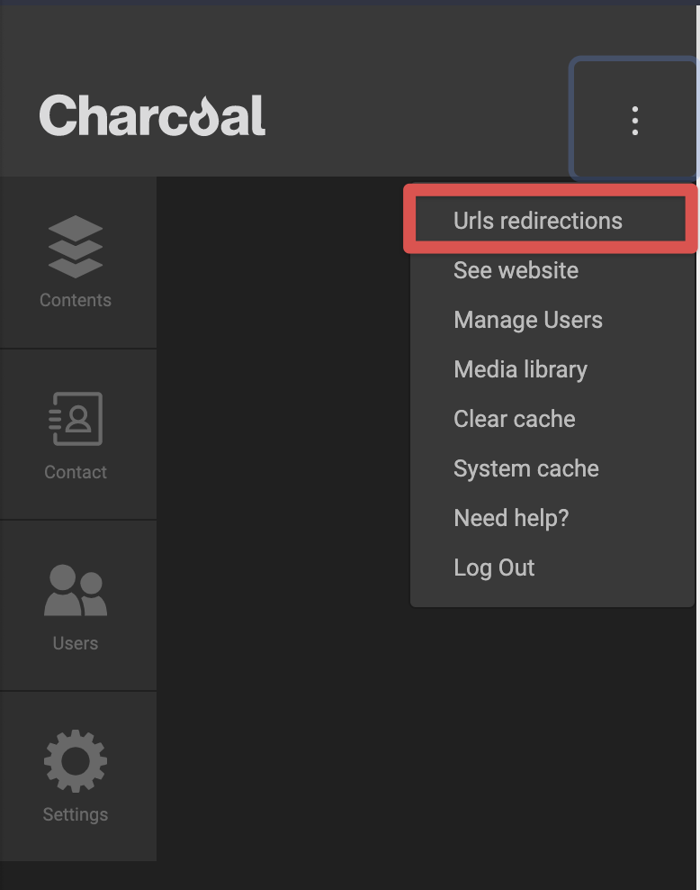

Charcoal Redirect
===============

[![License][badge-license]][charcoal-contrib-redirect]
[![Latest Stable Version][badge-version]][charcoal-contrib-redirect]
[![Build Status][badge-travis]][dev-travis]

A [Charcoal][charcoal-app] service provider to handle route redirections from the `admin` interface.


## Table of Contents

-   [Installation](#installation)
    -   [Dependencies](#dependencies)
-   [Service Provider](#service-provider)
    -   [Services](#services)
-   [Configuration](#configuration)
-   [Usage](#usage)
-   [Development](#development)
    -  [API Documentation](#api-documentation)
    -  [Development Dependencies](#development-dependencies)
    -  [Coding Style](#coding-style)
-   [Credits](#credits)
-   [License](#license)


## Installation

The preferred (and only supported) method is with Composer:

```shell
$ composer require locomotivemtl/charcoal-contrib-redirect
```


### Dependencies

#### Required

- [**PHP 7.4+**](https://php.net)


#### PSR

- [**PSR-11**][psr-11]: Common interface for dependency containers. Fulfilled by Pimple.


## Service Provider

The following services are provided with the use of [_
charcoal-contrib-redirect_](https://github.com/locomotivemtl/charcoal-contrib-redirect)

### Services

* [redirection](src/Charcoal/Redirect/Service/RedirectionService.php) instance
  of `\Charcoal\Redirect\Service\Redirection`


## Configuration

The only required configuration for the redirect module is to require the module in the list of loaded modules in the
app configuration.

```json
{
    "modules": {
        "charcoal/redirect/redirect": {}
    }
}
```


## Usage

When the module is loaded, a new database table (`charcoal_contrib_redirect_redirections`) will be created automatically
when needed. This table will be used to store redirections. When in the admin interface, a new _item_ is added to the
system menu dropdown (`Url redirections`)



This system menu item requires the user to adhere to the `"system/admin"` acl permission.

## Development

To install the development environment:

```shell
$ composer install
```

To run the scripts (phplint, phpcs, and phpunit):

```shell
$ composer test
```


### API Documentation

-   The auto-generated `phpDocumentor` API documentation is available at:  
    [https://locomotivemtl.github.io/charcoal-contrib-redirect/docs/master/](https://locomotivemtl.github.io/charcoal-contrib-redirect/docs/master/)
-   The auto-generated `apigen` API documentation is available at:  
    [https://codedoc.pub/locomotivemtl/charcoal-contrib-redirect/master/](https://codedoc.pub/locomotivemtl/charcoal-contrib-redirect/master/index.html)


### Development Dependencies

-   [php-coveralls/php-coveralls][phpcov]
-   [phpunit/phpunit][phpunit]
-   [squizlabs/php_codesniffer][phpcs]


### Coding Style

The charcoal-contrib-redirect module follows the Charcoal coding-style:

-   [_PSR-1_][psr-1]
-   [_PSR-2_][psr-2]
-   [_PSR-4_][psr-4], autoloading is therefore provided by _Composer_.
-   [_phpDocumentor_](http://phpdoc.org/) comments.
-   [phpcs.xml.dist](phpcs.xml.dist) and [.editorconfig](.editorconfig) for coding standards.

> Coding style validation / enforcement can be performed with `composer phpcs`. An auto-fixer is also available with `composer phpcbf`.


## Credits

- [Locomotive](https://locomotive.ca/)
- [Joel Alphonso](mailto:joel@locomotive.ca)


## License

Charcoal is licensed under the MIT license. See [LICENSE](LICENSE) for details.


[charcoal-contrib-redirect]:  https://packagist.org/packages/locomotivemtl/charcoal-contrib-redirect
[charcoal-app]:             https://packagist.org/packages/locomotivemtl/charcoal-app

[dev-scrutinizer]:    https://scrutinizer-ci.com/g/locomotivemtl/charcoal-contrib-redirect/
[dev-coveralls]:      https://coveralls.io/r/locomotivemtl/charcoal-contrib-redirect
[dev-travis]:         https://travis-ci.org/locomotivemtl/charcoal-contrib-redirect

[badge-license]:      https://img.shields.io/packagist/l/locomotivemtl/charcoal-contrib-redirect?style=flat-square
[badge-version]:      https://img.shields.io/packagist/v/locomotivemtl/charcoal-contrib-redirect?style=flat-square
[badge-scrutinizer]:  https://img.shields.io/scrutinizer/g/locomotivemtl/charcoal-contrib-redirect?style=flat-square
[badge-coveralls]:    https://img.shields.io/coveralls/locomotivemtl/charcoal-contrib-redirect?style=flat-square
[badge-travis]:       https://img.shields.io/travis/locomotivemtl/charcoal-contrib-redirect?style=flat-square

[psr-1]:  https://www.php-fig.org/psr/psr-1/
[psr-2]:  https://www.php-fig.org/psr/psr-2/
[psr-3]:  https://www.php-fig.org/psr/psr-3/
[psr-4]:  https://www.php-fig.org/psr/psr-4/
[psr-6]:  https://www.php-fig.org/psr/psr-6/
[psr-7]:  https://www.php-fig.org/psr/psr-7/
[psr-11]: https://www.php-fig.org/psr/psr-11/
[psr-12]: https://www.php-fig.org/psr/psr-12/
